# Platform Architecture

## Scope

This document explains the end-to-end architecture of the platform: cloud side, local side, runtime layers, worker model, and the major execution services inside the platform.

This document does not enumerate every route or payload field. For HTTP details, read `agent_docs/core/api_design.md`.

## System Context

The system is split across three runtime zones:

1. cloud-side API and OEM software runtime
2. reverse tunnel between cloud and local machine
3. local-side VCI client and real J2534 hardware access

```mermaid
flowchart LR
    GUI["Unified GUI"] --> API["Flask API (`server/`)"]
    API --> Platform["Platform Runtime (`diagnostic_platform/`)"]
    Platform --> Backend["Backend Facade (`backends/gds2/`)"]
    Backend --> GDS2["GDS2 Runtime (`src/`)"]
    GDS2 --> DLL["Virtual J2534 DLL"]
    DLL --> ReverseServer["Reverse Server (`vci_proxy/reverse_server.py`)"]
    ReverseServer --> Tunnel["Reverse Tunnel"]
    Tunnel --> ReverseClient["Reverse Client (`vci_proxy/reverse_client.py`)"]
    ReverseClient --> J2534["Local J2534 Driver"]
    J2534 --> Vehicle["Vehicle / VCI"]
```

## Layer Responsibilities

### API layer

Owned by `server/`.

Responsibilities:

- receive HTTP requests
- validate and normalize request input
- call platform runtime helpers
- expose JSON and SSE responses
- map known failures to HTTP status codes

The API layer should not know backend-specific page names, action enums, or GDS2 automation details.

### Platform runtime layer

Owned by `diagnostic_platform/`.

Responsibilities:

- define shared contract types
- resolve brand to backend through the backend registry
- bind a business session to a backend bundle
- enforce capability checks
- coordinate diagnostics start, decision gates, live data, navigation, DTC, and AI flows
- manage worker-local subordinate session bindings
- expose stream helpers for SSE

### Backend layer

Owned by `backends/`.

Responsibilities:

- adapt one OEM software runtime to the platform contract
- advertise descriptor metadata and capabilities
- expose core session operations
- own backend-specific live-data and AI payload collection behavior
- expose optional navigation and generic-action bridges

### OEM-specific runtime layer

Owned today mostly by `src/`.

Responsibilities for GDS2:

- UI navigation
- controller runtime and recovery
- data viewer workflow operations
- deterministic action schema and executor
- streaming collectors and diagnostics helpers

This layer is intentionally not the place where future OEMs should extend the platform contract.

## Worker Model

The current process model is:

- one worker process
- one active business session at a time
- one active backend bundle at a time
- optional subordinate navigation, live-data, and AI execution bound to that business session

The worker-scoped container is `diagnostic_platform/runtime/worker_runtime.py`.

Key objects:

| Type | Purpose |
| --- | --- |
| `WorkerRuntime` | Process-wide container for the active orchestrator, backend bundle, action runtime, AI engine bindings, SSE hubs, and operation lock |
| `WorkerOperation` | Cooperative cancellation token for one exclusive in-flight operation |
| `WorkerSessionBinding` | Bound business session id plus subordinate navigation/AI/live-data state |
| `ActiveBackendBundle` | Current backend instance plus descriptor and optional live-data/AI/navigation/action handles |
| `ScopedEventHub` | Worker-local in-memory pub/sub used for scoped SSE streams |

## Business Session Model

Business sessions are managed by `SessionOrchestrator` in `src/gds2_orchestration/session_orchestrator.py`.

The orchestrator owns:

- session records
- pending decisions
- session event queues
- status transitions such as `pending`, `running`, `awaiting_decision`, `completed`, `failed`, and `aborted`

The session object is the platform-visible source of:

- vehicle context
- selected backend
- selected module
- selected data category
- current status
- pending decision
- capability list

## Decision Architecture

The platform currently uses a unified decision model for three categories:

### Backend decision

Raised when brand resolution maps to multiple candidate backends or no direct runnable backend is selected.

### Network-quality decision

Raised during diagnostics start when tunnel quality is in a blocked state and the user must explicitly continue anyway or cancel.

### Branch decision

Raised when deterministic navigation or selection encounters an ambiguous branch and one option must be chosen to resume execution.

Decision payload generation lives across:

- `src/gds2_orchestration/session_orchestrator.py`
- `diagnostic_platform/runtime/session_decisions.py`
- `diagnostic_platform/runtime/session_preflight.py`

## Platform Runtime Services

The runtime layer is intentionally split into reusable services instead of keeping all logic in one Flask module.

| File | Responsibility |
| --- | --- |
| `diagnostic_platform/runtime/session_lifecycle.py` | session start, abort, and status payload helpers |
| `diagnostic_platform/runtime/session_preflight.py` | diagnostics start, network gate, override lifecycle |
| `diagnostic_platform/runtime/session_decisions.py` | backend/network/branch decision resolution |
| `diagnostic_platform/runtime/session_actions.py` | session-bound AI, navigation, live data, DTC, and action helpers |
| `diagnostic_platform/runtime/diagnostics_runtime.py` | direct diagnostics API helpers |
| `diagnostic_platform/runtime/navigation_runtime.py` | standalone navigation runtime |
| `diagnostic_platform/runtime/session_streams.py` | SSE stream generators |

## Capability-First Design

The platform is being organized around backend capabilities instead of backend-name branching.

Important consequences:

- session routes should validate capability support before doing work
- unsupported capability requests should surface deterministically, typically as `501 Not Implemented`
- the GUI should not hard-code GDS2 startup as the only product path
- future OEMs should implement capabilities in `backends/<name>/` instead of modifying session orchestration logic

Capability details are documented in `agent_docs/core/backend_architecture.md`.

## Current Transitional State

The architecture direction is platform-neutral, but the implementation is not yet completely free of GDS2-owned internals.

Important current facts:

- `SessionOrchestrator` still lives under `src/gds2_orchestration/`
- some runtime helpers still import GDS2 action/planner types
- only `GDS2DiagnosticBackend` is registered in the backend registry

This means the platform boundary is the target architecture, while some internals are still being migrated toward it.

## Operational Dependencies

The platform also depends on runtime facts outside Python package boundaries:

- GDS2 is a separate OEM application process
- the Java agent writes state to `~/gds2-data/latest.json`
- the reverse tunnel publishes tunnel-quality snapshots to `%PROGRAMDATA%/VCI_Proxy/tunnel_quality.json`
- secrets such as the ZhipuAI API key live in `%APPDATA%/VCI_Proxy/config.json`

## Read Next

- Backend contract and registry model: `agent_docs/core/backend_architecture.md`
- Route semantics and payloads: `agent_docs/core/api_design.md`
- Step-by-step runtime sequences: `agent_docs/core/runtime_flows.md`
