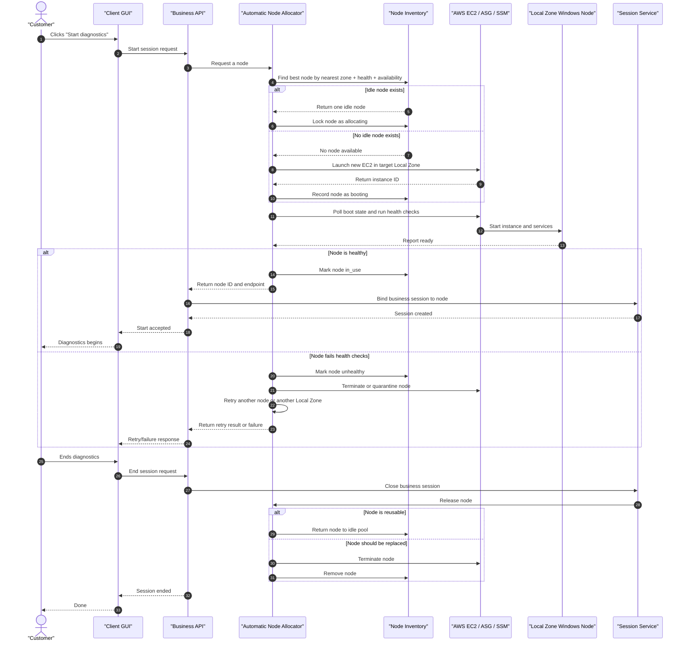

# AWS Local Zone node allocation

## Scope

This guide describes how to run AWS Local Zone worker nodes as an automatically
allocated pool instead of manually creating one Windows EC2 instance per
customer.

This document focuses on:

- when to use one-user-per-node
- what "automatic node allocation" means in practice
- how to size idle capacity in busy metros
- how to find the best Local Zone for a user
- how to estimate cost and delivery difficulty

This document does not replace the single-node deployment guide in
`agent_docs/ops/aws_local_zone_customer_node.md`. Read that document for the
shape of one node. Read this document for the fleet-level allocation strategy.

## Plain-language summary

Treat the platform as a pool of cloud diagnostics workstations:

- each active customer session gets one dedicated Windows node
- the customer still uses the normal diagnostics GUI
- the backend automatically chooses a Local Zone and allocates a node
- if an idle node is already available, the customer starts quickly
- if not, the platform launches a new node automatically
- when the session ends, the node is either returned to the pool or terminated

This is an automated backend service, not a human-operated control console.

## Why one active user per node is the default

The current repository already assumes a single active business session per
worker and a single GDS2 runtime per machine.

Current repo-level facts:

- `README.md` states `1 worker process = 1 active business session = 1 active backend bundle`
- `agent_docs/core/platform_architecture.md` describes one active business session at a time
- `agent_docs/ops/deployment_and_operations.md` states one GDS2 instance is assumed per machine
- `agent_docs/ops/aws_local_zone_customer_node.md` already frames the deployment as one dedicated diagnostics workstation in the cloud

That makes one-user-per-node the safest current production shape because:

- the diagnostics software is Windows GUI software with machine-local state
- GDS2 and the Java agent are host-singleton assumptions today
- sharing one node across unrelated customers would introduce focus, session,
  recovery, and isolation risks

For the current codebase, the right model is:

- `1 active customer session = 1 dedicated Windows EC2 node`

This does not mean one customer owns one permanent machine forever. It means
one active session temporarily occupies one dedicated machine.

## What "automatic node allocation" means

"Node allocation control plane" means backend automation, not a person clicking
buttons.

The customer flow should remain:

1. the customer starts diagnostics from the existing GUI
2. the GUI calls the existing backend API
3. the backend automatically finds or launches a node
4. the backend binds the session to that node
5. the customer continues diagnostics without seeing any AWS details

The minimum backend services needed are:

- `allocator`: chooses a Local Zone and allocates a node
- `inventory`: stores node state such as `idle`, `allocating`, `booting`, `in_use`, `draining`, and `unhealthy`
- `health checker`: verifies that the node is truly ready for diagnostics
- `recycler`: returns nodes to the pool or terminates them after a session

An operator-facing dashboard is optional. It can help observe pool size, failed
launches, or unhealthy nodes, but it is not part of the customer workflow.

## Recommended AWS model

Use one pool per Local Zone or per Local Zone group.

Recommended AWS building blocks:

- `Launch Template` for one Windows diagnostics node image
- `Auto Scaling Group` per Local Zone pool
- `Warm Pool` only as an optional secondary acceleration layer
- `On-Demand Capacity Reservations (ODCR)` for guaranteed capacity in busy Local Zones
- `Savings Plans` for baseline cost reduction
- `SSM` or equivalent remote execution for health checks and bootstrap

Recommended pool strategy:

- `hot pool`: a small number of running, fully initialized, health-checked idle nodes in busy metros
- `cold launch`: if the hot pool is empty, automatically launch a new node
- `secondary warm pool`: optionally keep additional nodes in `Stopped` or `Hibernated` state only after resume reliability is proven

Do not rely only on a stopped warm pool for the first production rollout.

Reason:

- `scripts/cloud_start_services.bat` skips GDS2 launch in Session 0
- a Windows EC2 instance being `running` does not guarantee that GDS2, the Java agent, Flask, the reverse server, and the edge proxy are all actually ready

For active customer sessions:

- prefer On-Demand or ODCR-backed nodes
- do not use Spot Instances

## Boss-friendly sequence diagram



## How to choose the best Local Zone

There is no single AWS feature that says "this is the nearest Local Zone for
this user and this workload" in one call.

Use a practical selection strategy:

1. narrow the candidates by geography
2. prefer the Local Zone that has healthy idle capacity
3. if more than one candidate exists, use measured latency to break ties
4. if the best zone has no capacity, fallback to the next-best zone

Recommended inputs for the allocator:

- user geography inferred from customer org, city, or GeoIP
- measured RTT or TTFB from the GUI to a small probe endpoint
- Local Zone inventory state
- supported instance types in that Local Zone
- business rules such as "prefer same metro during business hours"

Implementation note for this repository:

- do not model subnet, node API base, or tunnel host as one global value for every customer
- keep a per-zone catalog instead
- the current code supports a zone catalog through `DIAGNOSTIC_NODE_ZONE_CATALOG_JSON` or `DIAGNOSTIC_NODE_ZONE_CATALOG_FILE`
- each catalog entry should describe one Local Zone's `zone`, `metro`, `subnet_id`, `api_base_url`, `tunnel_host`, and any per-zone overrides such as `instance_type`
- catalog entries can also include routing hints such as `time_zones` and `cities`, so the control plane can infer the nearest metro from client-side hints like `client_time_zone` or `client_city`
- the AWS smoke-test helper can now validate this route inference before launch by passing `--client-time-zone` or `--client-city`

Useful AWS discovery mechanisms:

- list Local Zones for an account:

```bash
aws ec2 describe-availability-zones \
  --region us-west-2 \
  --filters Name=zone-type,Values=local-zone \
  --all-availability-zones
```

- enable a Local Zone group:

```bash
aws ec2 modify-availability-zone-group \
  --region us-west-2 \
  --group-name us-west-2-lax-1 \
  --opt-in-status opted-in
```

- list instance types offered in a Local Zone:

```bash
aws ec2 describe-instance-type-offerings \
  --filters Name=location,Values=us-west-2-lax-1a \
  --location-type availability-zone
```

Route 53 geoproximity routing can be used when a stable public DNS entry should
prefer a Local Zone group. It is not a replacement for the allocator because it
does not know current node inventory or node health.

## Capacity and pool sizing guidance

Start small.

Recommended rollout:

- choose 2 to 3 target metros first
- keep a small `hot pool` only in those metros
- allow cold launches or fallback routing elsewhere

A good first operating model is:

- busy metros: maintain 2 to 5 hot nodes
- lower-demand metros: maintain 0 hot nodes and cold-launch on demand
- all metros with a known floor of traffic: consider ODCR for the guaranteed floor

Use ODCR for:

- morning peak
- business-hour bursts
- metros where capacity shortfall would be unacceptable

Use Savings Plans for:

- the baseline portion of compute that runs most of the time

Important AWS pricing rule:

- Savings Plans reduce cost, but they do not reserve capacity
- ODCR reserves capacity, but you pay for unused reserved capacity
- they can be used together

## Cost model

Local Zone pricing is zone-specific and instance-specific. Refresh prices
directly from AWS before making a budget commitment.

Cost categories that matter most:

- Windows EC2 hourly cost
- EBS root volume cost
- public IPv4 cost
- Local Zone data transfer
- optional ODCR unused capacity cost

Useful formulas:

- `monthly_compute = hourly_instance_price * 730`
- `monthly_hot_pool = monthly_compute * hot_pool_size`
- `public_ipv4_monthly = 0.005 * 730 * ipv4_count`
- `gp3_storage_monthly = gb_month_rate * provisioned_gb`

Example rates observed from AWS public pricing data on `2026-04-10`:

| Local Zone | Instance | OS | Hourly | Approx monthly at 730h |
| --- | --- | --- | --- | --- |
| `US East (Atlanta)` | `m6i.xlarge` | Windows | `$0.4240` | `$309.52` |
| `US East (Atlanta)` | `t3.xlarge` | Windows | `$0.2816` | `$205.57` |
| `US West (Los Angeles)` | `m5.xlarge` | Windows | `$0.4140` | `$302.22` |
| `US East (Atlanta)` | `g4dn.2xlarge` | Windows | `$1.3830` | `$1009.59` |

Public IPv4 reference rate observed from AWS VPC pricing:

- in-use public IPv4: `$0.005/hour`
- idle public IPv4: `$0.005/hour`

EBS gp3 example reference from AWS EBS pricing examples:

- example regional storage rate often modeled at `$0.08/GB-month`

Illustrative hot pool examples using the rates above:

- `3 x m6i.xlarge` in Atlanta: about `$928.56/month` for compute only
- `5 x m6i.xlarge` in Atlanta: about `$1547.60/month` for compute only

Practical note:

- burstable `t3` nodes can look cheaper, but sustained Windows diagnostics
  workloads can incur CPU credit costs
- start with non-burstable defaults unless measurements prove otherwise

## Delivery difficulty

This is not primarily hard because of AWS APIs. It is hard because of state
management and Windows diagnostics readiness.

### MVP difficulty

Difficulty:

- medium

Typical MVP scope:

- 1 to 2 Local Zones
- one-user-per-node only
- small hot pool
- automatic allocation on `/api/session/start`
- health-check gating before a node is handed to a customer
- release or terminate on session end

Rough delivery estimate:

- `2 to 4 weeks` for a working MVP
- plus `1 to 2 weeks` of stabilization and operational hardening

### Production difficulty

Difficulty:

- medium to high

Production adds:

- fallback across multiple Local Zones
- race-condition handling for concurrent claims
- retries, quarantine, and cleanup for bad nodes
- inventory drift correction
- alerting and observability
- capacity policy by metro and by business hours

Rough delivery estimate:

- `6 to 10 weeks` for a robust production rollout

## Main technical risks

The biggest risks are:

- node readiness is harder than EC2 boot completion
- Windows Session 0 and GUI automation assumptions can break diagnostics startup
- one idle node can be double-allocated if inventory locking is weak
- unhealthy nodes can silently consume pool capacity
- Local Zone capacity can disappear during spikes without ODCR

## Recommended execution order

1. choose 2 to 3 candidate Local Zones for the first rollout
2. build one Windows node image with all required software and startup logic
3. implement inventory state and allocator logic
4. add health checks that prove a node is actually diagnostics-ready
5. call the allocator automatically before binding a new business session
6. add node release and cleanup behavior
7. add hot pools and ODCR only in metros with real demand
8. add observability and fallback routing before scaling to more metros

## Read next

- one-node deployment shape: `agent_docs/ops/aws_local_zone_customer_node.md`
- environment and runtime operations: `agent_docs/ops/deployment_and_operations.md`
- platform runtime and worker model: `agent_docs/core/platform_architecture.md`
