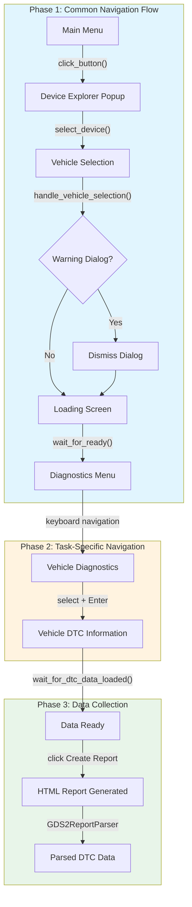
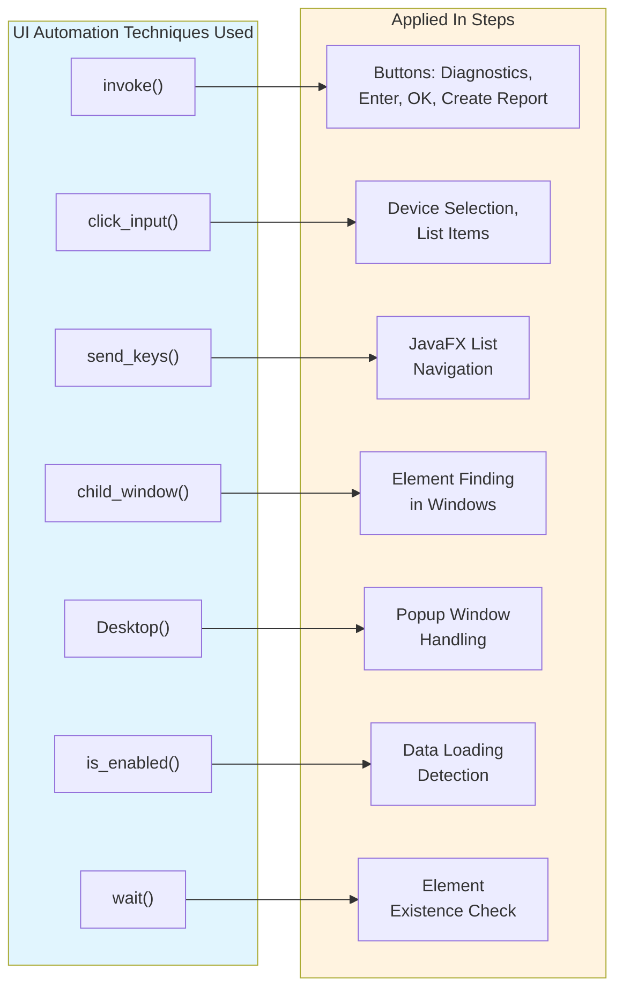
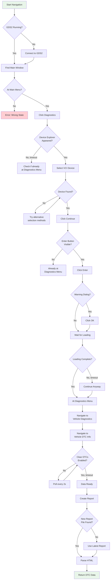
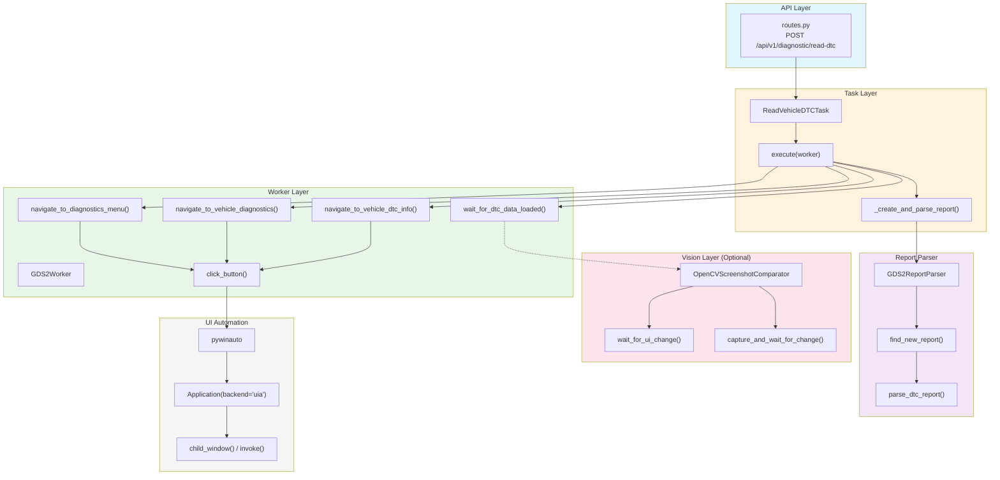
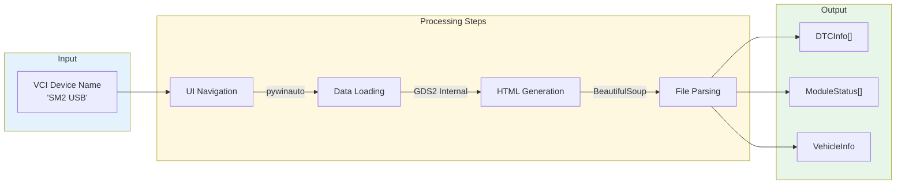
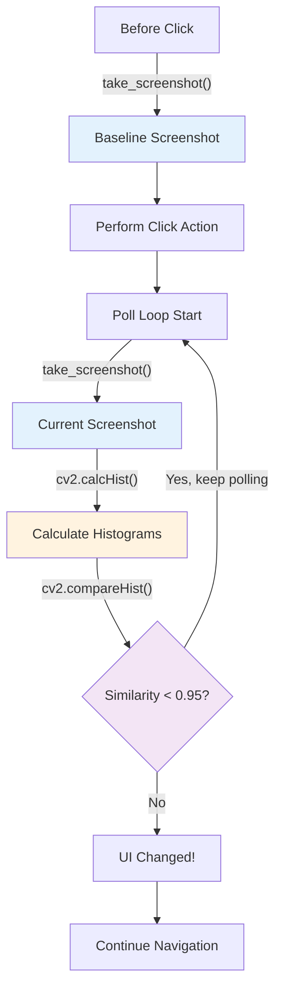

# GDS2 RPA Demo Workflow

**Complete Navigation Flow: Main Menu → DTC Data**

This document provides a comprehensive visual workflow of the GDS2 RPA automation demo, including the techniques used at each step and key code references.

---

## High-Level Flow Overview



---

## Detailed Step-by-Step Flow

```mermaid
flowchart TD
    subgraph START["Start Point"]
        S1["GDS2 Application Open<br/>User logged in<br/>Vehicle connected"]
    end

    subgraph STEP1["Step 1: Click Diagnostics Button"]
        direction TB
        A1["Main Menu Page"]
        A2["Technique: invoke() method"]
        A3["Code: worker.click_button<br/>(selectors.DIAGNOSTICS_BUTTON)"]
        A1 --> A2 --> A3
    end

    subgraph STEP2["Step 2: Device Explorer Popup"]
        direction TB
        B1["Popup Window Appears"]
        B2["Technique: Desktop() + child_window()"]
        B3["Multi-strategy device selection:<br/>1. DataItem search<br/>2. Text element search<br/>3. ListItem search<br/>4. General element search"]
        B4["Code: device_window.child_window<br/>(title='Continue').click_input()"]
        B1 --> B2 --> B3 --> B4
    end

    subgraph STEP3["Step 3: Vehicle Selection Page"]
        direction TB
        C1["Vehicle Selection Page"]
        C2["Technique: invoke() for button click"]
        C3["Check: Module Diagnostics ListItem<br/>exists = already at menu"]
        C4["Code: enter_btn.invoke()"]
        C1 --> C2 --> C3 --> C4
    end

    subgraph STEP4["Step 4: Warning Dialog"]
        direction TB
        D1["Optional Warning Dialog"]
        D2["Technique: Desktop().windows() scan"]
        D3["Look for OK button in any<br/>GDS/Warning titled window"]
        D4["Code: ok_btn.invoke() or<br/>ok_btn.click_input()"]
        D1 --> D2 --> D3 --> D4
    end

    subgraph STEP5["Step 5: Wait for Loading"]
        direction TB
        E1["Loading Screen"]
        E2["Technique: Polling + text detection"]
        E3["Check for: Loading, Please wait,<br/>Processing, Reading, Communicating"]
        E4["Also check: ProgressBar control"]
        E1 --> E2 --> E3 --> E4
    end

    subgraph STEP6["Step 6: Diagnostics Menu"]
        direction TB
        F1["Diagnostics Menu Page"]
        F2["Technique: Keyboard Navigation"]
        F3["1. Click Module Diagnostics<br/>   to focus list<br/>2. send_keys('{DOWN}')<br/>3. send_keys('{ENTER}')"]
        F4["Why: JavaFX lists don't<br/>respond to select()/click()"]
        F1 --> F2 --> F3 --> F4
    end

    subgraph STEP7["Step 7: Vehicle Diagnostics Submenu"]
        direction TB
        G1["Vehicle Diagnostics Submenu"]
        G2["Technique: ListItem selection + Enter"]
        G3["1. Find 'Vehicle DTC Information'<br/>   in ListItems<br/>2. item.select() or click_input()<br/>3. Find Enter button<br/>4. enter_btn.invoke()"]
        G1 --> G2 --> G3
    end

    subgraph STEP8["Step 8: Wait for DTC Data"]
        direction TB
        H1["Vehicle DTC Information Page"]
        H2["Technique: Button state polling"]
        H3["Check: Clear DTCs button<br/>Disabled = Still loading<br/>Enabled = Data ready"]
        H4["Code: clear_btn.is_enabled()<br/>Timeout: 120 seconds"]
        H1 --> H2 --> H3 --> H4
    end

    subgraph STEP9["Step 9: Create Report"]
        direction TB
        I1["Click Create Report Button"]
        I2["Technique: invoke() + file monitoring"]
        I3["1. Get existing report files<br/>2. Click Create Report<br/>3. Wait for new file in<br/>   %LOCALAPPDATA%/Temp/GDS 2/"]
        I1 --> I2 --> I3
    end

    subgraph STEP10["Step 10: Parse HTML Report"]
        direction TB
        J1["HTML Report File"]
        J2["Technique: BeautifulSoup parsing"]
        J3["Extract:<br/>- VehicleInfo (VIN, Make, Model)<br/>- ModuleStatus (name, dtc_count)<br/>- DTCInfo (code, description)"]
        J4["Return: Structured dict<br/>with 31 DTCs"]
        J1 --> J2 --> J3 --> J4
    end

    S1 --> STEP1
    STEP1 --> STEP2
    STEP2 --> STEP3
    STEP3 --> STEP4
    STEP4 --> STEP5
    STEP5 --> STEP6
    STEP6 --> STEP7
    STEP7 --> STEP8
    STEP8 --> STEP9
    STEP9 --> STEP10

    style START fill:#f3e5f5
    style STEP1 fill:#e3f2fd
    style STEP2 fill:#e3f2fd
    style STEP3 fill:#e3f2fd
    style STEP4 fill:#e3f2fd
    style STEP5 fill:#e3f2fd
    style STEP6 fill:#fff8e1
    style STEP7 fill:#fff8e1
    style STEP8 fill:#e8f5e9
    style STEP9 fill:#e8f5e9
    style STEP10 fill:#e8f5e9
```



---

## Technique Summary by Step



---

## Decision Points Flow



---

## Code Architecture Flow



---

## Data Flow



---

## Key Code Snippets

### Step 1: Click Diagnostics Button
```python
# Location: worker.py:935
self.click_button(self.selectors.DIAGNOSTICS_BUTTON, wait_after=2)
# Uses invoke() method for reliable JavaFX button clicks
```

### Step 2: Select VCI Device
```python
# Location: worker.py:600-695
# Multi-strategy selection (4 methods attempted in order):
# 1. DataItem search
device_window.descendants(control_type="DataItem")
# 2. Text element search
device_window.descendants(control_type="Text")
# 3. ListItem search
device_window.descendants(control_type="ListItem")
# 4. General element search
device_window.descendants()
```

### Step 6: Keyboard Navigation (JavaFX Lists)
```python
# Location: worker.py:1077-1099
from pywinauto.keyboard import send_keys

# Focus the list by clicking first item
module_diag = window.child_window(title="Module Diagnostics", control_type="ListItem")
module_diag.click_input()

# Navigate using keyboard
send_keys("{DOWN}")   # Move to Vehicle Diagnostics
send_keys("{ENTER}")  # Activate selection
```

### Step 8: Data Loading Detection
```python
# Location: worker.py:217-259
def wait_for_dtc_data_loaded(self, timeout=120):
    while time.time() - start < timeout:
        clear_btn = window.child_window(title="Clear DTCs", control_type="Button")
        if clear_btn.exists(timeout=2):
            if clear_btn.is_enabled():  # Key check!
                return True  # Data loaded
        time.sleep(2)
```

### Step 10: HTML Report Parsing
```python
# Location: report_parser.py
def parse_dtc_report(self, report_path):
    soup = BeautifulSoup(html_content, "html.parser")

    # Extract vehicle info from header
    vehicle_info = self._parse_vehicle_info(soup)

    # Extract module status from summary table
    module_status = self._parse_module_status(soup)

    # Extract individual DTCs
    dtc_list = self._parse_dtc_details(soup)

    return {
        "vehicle_info": vehicle_info,
        "module_status": module_status,
        "dtc_list": dtc_list,
    }
```

---

## Vision-Enhanced Flow (Optional)

When `enable_screenshot_validation=True`:



---

## Summary

| Step | Page | Technique | Key Method |
|------|------|-----------|------------|
| 1 | Main Menu | `invoke()` | `click_button()` |
| 2 | Device Explorer | `Desktop()` + multi-strategy | `select_device()` |
| 3 | Vehicle Selection | `invoke()` | `handle_vehicle_selection()` |
| 4 | Warning Dialog | `Desktop().windows()` scan | `dismiss_warning_dialog()` |
| 5 | Loading | Text/ProgressBar polling | `wait_for_ready()` |
| 6 | Diagnostics Menu | `send_keys()` keyboard nav | `navigate_to_vehicle_diagnostics()` |
| 7 | Vehicle Diagnostics | `select()` + `invoke()` | `navigate_to_vehicle_dtc_info()` |
| 8 | Vehicle DTC Info | `is_enabled()` polling | `wait_for_dtc_data_loaded()` |
| 9 | Create Report | `invoke()` + file watch | `_create_and_parse_report()` |
| 10 | Parse HTML | BeautifulSoup | `GDS2ReportParser.parse_dtc_report()` |

---

## Files Involved

```
src/workers/gds2/
├── worker.py           # Main UI automation logic
├── selectors.py        # UI element locators
├── tasks.py            # Task definitions (ReadVehicleDTCTask)
└── report_parser.py    # HTML report parsing

src/vision/
└── screenshot_comparator.py  # Optional: OpenCV-based UI change detection
```
